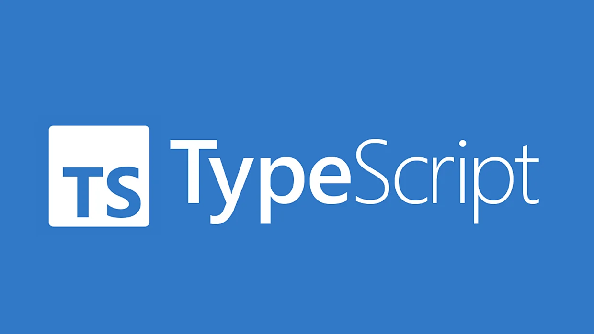

 
## How many types?

I've had a bit of JavaScript experience before, so going into learning TypeScript I didn't think much of it. I was correct in the fact that it wouldn't be too difficult. It's right there in the name, <b>Type</b>Script, but there's much more nuance in it than I had expected. When I say "a bit of JavaScript experience", that meant less than a year in high school where it was the main focus and final project of the year. Oh boy, the project management in that website was not great. It was the type of code you'd write intensively for a while, then leave and come back to it being unable to make heads or tails of any of it. I feel having the many, many types in TypeScript could have made my life a lot easier back then. 

## Breaking it in

TypeScript being such a rigid language means it requires it's user to type a lot more. I think this is acceptable when using it without a time crunch, however that's not how quizzes in class work. I remember in the first quiz I lost a lot of time due to having to go back and write in the sections TypeScript requires compared to JavaScript. 

## The long game...

Daily homework was something I expected out of ICS314, as that was the main warning many people gave going into it. Personally, I don't think it's that bad. As Brook says, daily practice is how you learn. At the start I remember being sort of humbled how much I overestimated how much I remembered from 3 years ago. As much as I bemoaned doing the w2school course and the typescript tutorial, it did meaningfully jog my memory. Now, this long, daily string of assignments while annoying I can accept as useful to my learning. 
