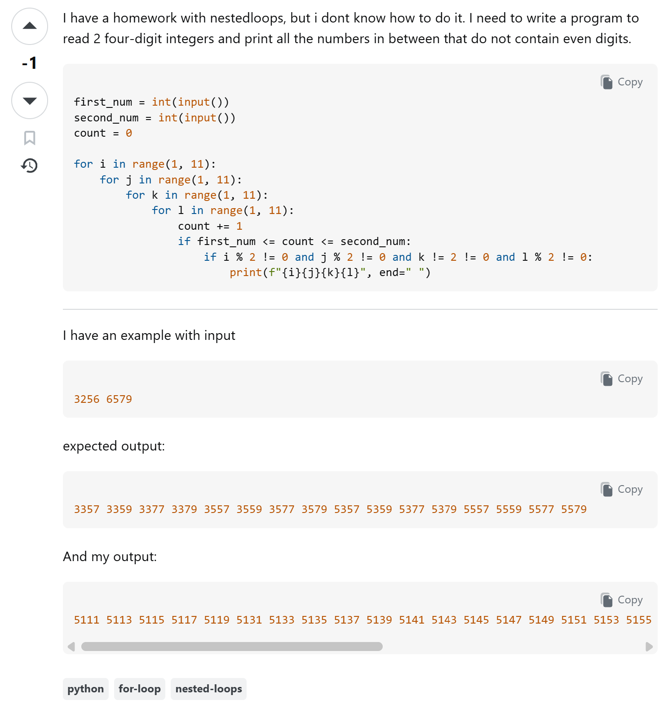

## What is a smart question?

In technical communities and modern workplaces, the ability to ask a "smart question" is an essential skill that separates questions people want to answer and those who people do not. Rather than simply outsourcing a problem to others, a well made question demonstrates that you have already researched the issue, isolated the specific failure point, and tested potential solutions. Who knows, maybe during the time you've researched the issue you solved the problem and can move on without asking others for help. If not, then a question that has already done it's due diligence is infinitely more likely to get a real solution than a vague mess of a question. 

## What characterizes a bad question?

Bad questions can be of many forms. According to [Eric Raymond's guide to smart questions](http://www.catb.org/esr/faqs/smart-questions.html), the antithesis of a smart question would be the following. It would demand an answer to the question without showing the questioner did any prior research. It has a vague title and incomplete work that hardly describes what the specific problem is at all. It is unreproducible and often leaves answerers guessing as to what the specific problem they wanted solved actually is. It also specifies that the question comes from the person's homework, which the questioner should be doing on their own. Ultimately, a bad question is one that treats the people they are asking to solve their question like an all powerful and all knowing machine that can remove the obstacles in their path. 

## Example of a bad question

I went onto Stack Overflow and searched for an example of a bad question and believe I found one that hits most, if not all, of the characteristics of a [bad question](https://stackoverflow.com/questions/75023213/barcode-generator-homework).



Firstly, it's title does not describe what the problem is while also telling us that this is a homework assignment and thus, should not be asked on Stack Overflow. Next, the body of the post does not explain what the code is exactly trying to achieve and it's methodology. The code itself is not descriptive either, with specific unexplained portions of it not telling why there are so many for loops or the usage of parts like the count variable. It checks most of the bad question boxes and left the people viewing the post confused on what exactly the original poster wanted. 

## Example of a smart question

Conversely I went on Stack Overflow and searched for an example of a smart question. It is the, as of current, highest rated post on Stack Overflow titled: "[Why is conditional processing of a sorted array faster than of an unsorted array?](https://stackoverflow.com/questions/11227809/why-is-conditional-processing-of-a-sorted-array-faster-than-of-an-unsorted-array)".

To begin, it has an excellent title that is straight to the point. If someone had expertise on the topic they would immediately know what the solution is and be ale to reply accordingly. The author had done their due diligence and tested their question with their own reasoning and gave a piece of code for others to reproduce the effect. 

```
// Source - https://stackoverflow.com/q/11227809
// Posted by GManNickG, modified by community. See post 'Timeline' for change history
// Retrieved 2026-09-10, License - CC BY-SA 4.0

#include <algorithm>
#include <ctime>
#include <iostream>

int main()
{
    // Generate data
    const unsigned arraySize = 32768;
    int data[arraySize];

    for (unsigned c = 0; c < arraySize; ++c)
        data[c] = std::rand() % 256;

    // !!! With this, the next loop runs faster.
    std::sort(data, data + arraySize);

    // Test
    clock_t start = clock();
    long long sum = 0;
    for (unsigned i = 0; i < 100000; ++i)
    {
        for (unsigned c = 0; c < arraySize; ++c)
        {   // Primary loop.
            if (data[c] >= 128)
                sum += data[c];
        }
    }

    double elapsedTime = static_cast<double>(clock()-start) / CLOCKS_PER_SEC;

    std::cout << elapsedTime << '\n';
    std::cout << "sum = " << sum << '\n';
}
```

Instead of asking someone to fix broken syntax or write code for them, the author asked why an unexpected hardware behavior occurs. This invited an educational answer about CPU branch prediction from multiple people with the [top answer](https://stackoverflow.com/a/11227902) going very much into the details of why and how this has happened and what it means to the code that the author wrote.

## Conclusion

When you have a question there is a slew of things to consider before going on a forum like Stack Overflow or asking the nearest friend or coworker. This doesn't only have to be about code as well. In my experience, there are plenty of times where my friends or sisters went out of their way to ask me a question which is easily resolvable through a quick Google search. Respecting the times of others and learning solutions by oneself are great qualities to have when deciding to ask a smart question. 
