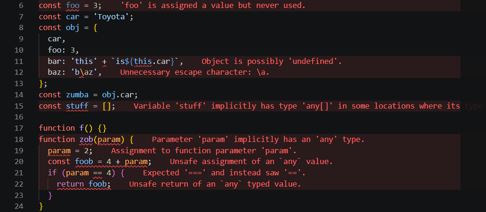

<br>
## What is a coding standard?

Before talking about my own impressions of this class's, ICS314, coding standards I must first introduce what the standards are in the first place. In ICS314 we use ESLint, an error checker for stying code properly. When using ESLint on VSCode there is a red highlight on every line of code not conforming to the coding standard. 

For example:



Some might say that this helps people learn programming languages the right way. After all, when working with other people on a larger project, the code that one should write shouldn't be unreadable to others. The ideal scenario is that when a coworker sees your part of the code, the would be able to understand fully what the code is trying to do without having to hum and haw about what exactly your code does. If there's an unused variable then it shouldn't exist! 

## My impressions...

Personally, I don't love or hate enforcing the ESLint coding standard. I understand why it exists and removing the ESLint errors is not a big deal. It's not as if at the end of a project I have to go through every line individually and make small edits. It isn't actually that much effort. If I were to have to pick <b>one</b> part of ESLint that I do not like, it would be enforcing double space indents instead of tabs. 

```
// double spaces example

if (true) {
  console.log('true');
}

// tab example

if (true) {
    console.log('true');
}
```

Most of the internet agrees that tabs are the standard. As such, most code on the internet is formatted in that way. If I were to want to cut and paste a code snippet from the internet to my project files, I would have to edit each line to conform to ESLints standards. That in of itself isn't much trouble, but does get repetitively annoying quickly. Otherwise there isn't much change in my individual work flow that ESLint would efect. In conclusion, I don't really mind ESLint or coding standards as a whole. 
