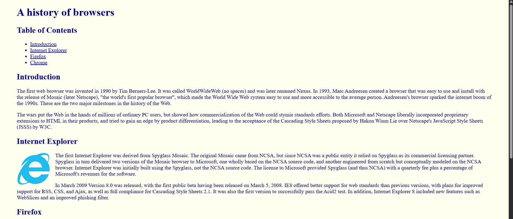

 
## What's in a UI framework? 

UI frameworks are helpful tools when trying to make a new website. Plenty of HTML and CSS is very repedative and bland which, after learning the basics, turns creating websites into a very repidative task. UI frameworks cuts out the boring busy work and lets the designer deal with design tasks instead of coding tasks. However, the downside is having to learn how a UI framework works in the first place. Bootstrap is one such UI framework that I feel is a great starting point. 

## Before frameworks...

Before even learning a UI framework one must learn HTML and CSS. One could do everything a framework does by oneself without having to touch a UI framework. Yet the time to create a website without one is tremendous. Here is an example of a website made with purely HTML and CSS.

It looks aweful and yet the styling may have taken minutes to get to a specific way that looks alright. Take colors for example, text and background color must be carefully considered to not clash with eachother. That's a whole lot of thinking that could be avoided. 

## Bootstrap...

Here is an example of a website using Bootstrap. Given 100 people, 100 people would say this website looks better than the one previously. This kind of website using pure HTML and CSS would be hundreds of lines of CSS code, yet this website only uses 51 lines of it. In terms of time efficiency, not using a UI framework is incomparably slow. It isn't all sunshine and rainbows however.

You have to first learn how a any UI framework like Bootstrap works before using it, and when just starting out you find out how abstract a lot of the names for things are. Take Bootstrap for example, when making padding or margins for a div the syntax for it is quite abstract. It simplifies the writing to something like 'px-5'. 'px-5' means padding on the left and right by 3rem. It isn't particularly intuitive at first glance and takes some getting used to. Little things like this make learning UI frameworks frustrating, but the payoff in my opinion is worth it. 