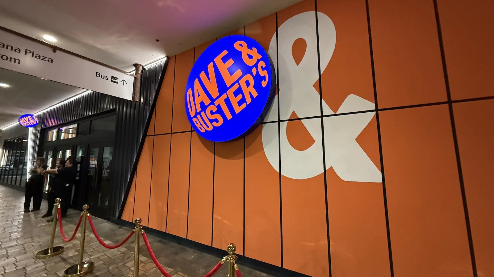

  

I love arcade games, but finding time to go out and play them isn't the easiest. Thus, I found out ways to emulate the experience at home. 

The setup for the 4 or 5 games I got all had their own quirks and little problems. It was pretty fun seeing what exactly is on the other side of the screen and how the systems were setup and maintained over the years and the workarounds people found to make porting it to be available at home possible. There are some genuinely great services out there people make for the community for free. 

The quirks and problems each game presented showed me a wildly different system that I've never seen before. It was probably the first time I'd dealt with config files, dlls and problems with setting up connections with servers. All of which are pretty basic things but which were learned by encountering roadblocks in goals and learning to overcome them. 
