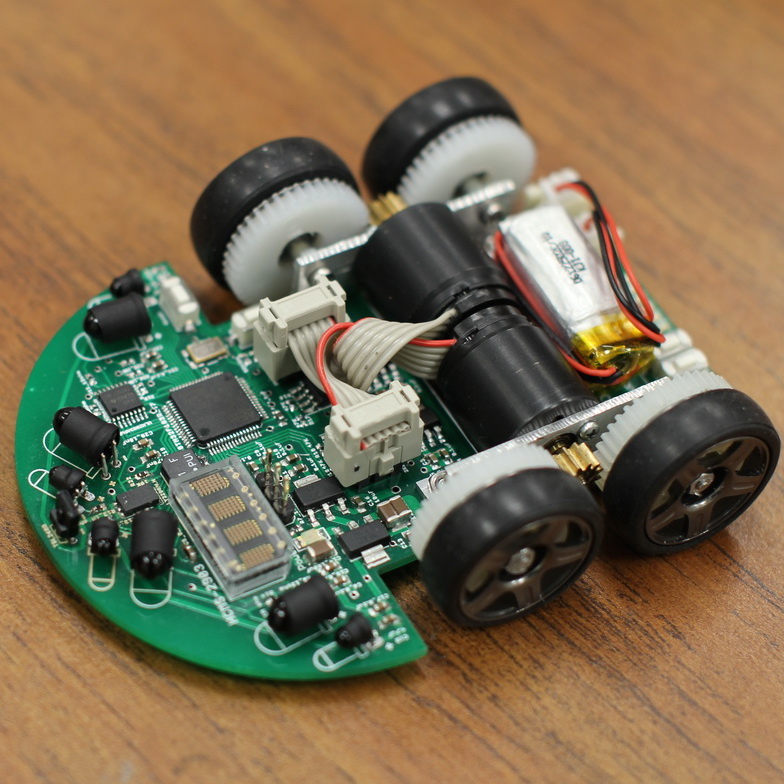

<div class="text-center p-4">
  
  
  
</div>

For my junior year in high school for my programing class my class was given the task of using JavaScript's p5.js to make a website videogame as our final project. My teacher, Mr. Kam, described the most basic kind of video game to make with p5.js would be a platformer like Mario with a character interacting with platforms and jumping around with a basic physics engine, however I wanted to do something different. 

I made a platformer where the mouse is used as the character to do puzzles in a 2 dimensional map using p5.js. It came with a lot more quirks about the built in p5.js physics engine that made me learn a lot about being creative to overcome non-standard problems. Though, if I were to do this project again, I wouldn't make it a browser game. 

```cpp
byte ADCRead(byte ch)
{
    word value;
    ADC1SC1 = ch;
    while (ADC1SC1_COCO != 1)
    {   // wait until ADC conversion is completed   
    }
    return ADC1RL;  // lower 8-bit value out of 10-bit data from the ADC
}
```

You can learn more at the [UH Micromouse News Announcement](https://manoa.hawaii.edu/news/article.php?aId=2857).
