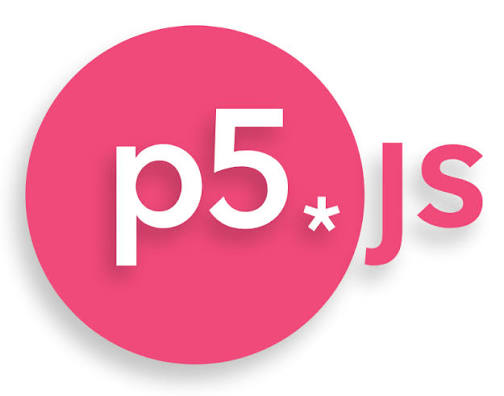

  

For my junior year in high school for my programing class my class was given the task of using JavaScript's p5.js to make a website videogame as our final project. My teacher, Mr. Kam, described the most basic kind of video game to make with p5.js would be a platformer like Mario with a character interacting with platforms and jumping around with a basic physics engine, however I wanted to do something different. 

I made a platformer where the mouse is used as the character to do puzzles in a 2 dimensional map using p5.js. It came with a lot more quirks about the built in p5.js physics engine that made me learn a lot about being creative to overcome non-standard problems. Though, if I were to do this project again, I wouldn't make it a browser game as I don't believe JavaScript and browser based physics was meant for the kind of game I made. There were certain limitations that came with the medium that simply couldn't be overcome. 

I ended up losing the project file due to having coded it on repl.it, the older version of replit.com, a browser based IDE, who deletes untouched data after a year of inactivity. I also lost access to my old high school email due to the account being deleted due to how long its been since high school. This project was perhaps one of my first ones with so much freedom and thus is special to me. 

You can learn more about [p5js](https://p5js.org/) , the JavaScript tool used, here.
